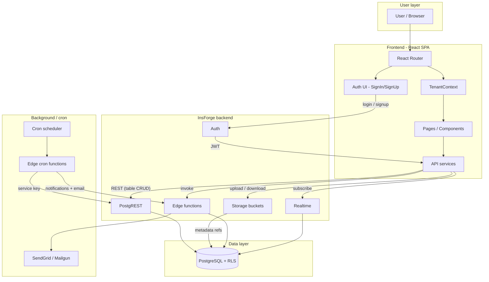

# High-level data flow diagram for SafeCloudAfrica

## Context

SafeCloudAfrica is a multi-tenant IDSMP (Integrated Management System) web app. The frontend is a React SPA that talks to an **InsForge** managed backend (no custom API server in this repo). Data flows through PostgREST, Auth, Storage, and Edge Functions; the database is PostgreSQL with RLS for tenant isolation.

---

## High-level data flow diagram

---

## Flow summary

| Flow           | Path                                                                                                                                   |
| -------------- | -------------------------------------------------------------------------------------------------------------------------------------- |
| **Auth**       | User → Auth UI → InsForge Auth → JWT → set on SDK in [src/index.tsx](src/index.tsx) → all later API calls carry token; RLS uses `request_user_id()` from JWT. |
| **Tenant**     | After login, [TenantContext](src/tenant/TenantContext.tsx) loads `company_memberships` for user → active company drives workspace and RLS. |
| **CRUD**       | Pages → [api/services](src/api/services) → `insforge.database.from('table')` → PostgREST → PostgreSQL (RLS enforced).                 |
| **Files**      | Upload UI → InsForge Storage bucket → metadata row in `documents` (or similar) via services.                                           |
| **Serverless** | Services call `insforge.functions.invoke()` (e.g. email); [scripts/insforge-functions](scripts/insforge-functions) host cron jobs that query DB and send email via SendGrid/Mailgun. |
| **Realtime**   | Optional: [realtimeService](src/api/services/realtimeService.ts) / [useRealtime](src/api/hooks/useRealtime.ts) subscribe to table changes via InsForge Realtime → PostgreSQL. |

---

## Main entities (for reference)

- **Tenant**: `companies`, `company_memberships`, `company_invites`, `platform_admins`
- **Core**: `incidents`, `tasks`, `corrective_actions`, `documents`, `activity_logs`, `form_templates`
- **Compliance / quality**: `audits`, `inspection_runs`, `quality_ncrs`, `risk_assessments`, `ppe_stock` / `ppe_issue_tracker`
- **Notifications**: `notifications` (written by cron/edge functions; email sent via Edge Functions)

Schema is defined in [docs/phase2-schema.sql](docs/phase2-schema.sql) and [docs/migrations](docs/migrations).
